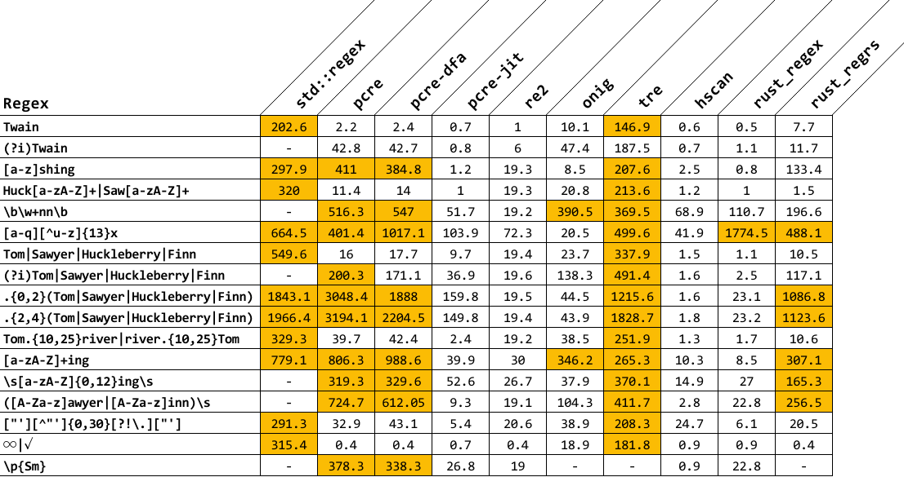

# Regex Performance
[](https://travis-ci.org/rust-leipzig/regex-performance)

## Introduction
Regular expressions are commonly used in pattern search algorithms.
This tool is based on the work of John Maddock (See his own regex comparison [here](http://www.boost.org/doc/libs/1_41_0/libs/regex/doc/gcc-performance.html))
and the sljit project (See their regex comparison [here](http://sljit.sourceforge.net/regex_perf.html)).

## Requirements
| dependency | version  |
|------------|----------|
| Cmake      | >=3.0    |
| Ragel      | 6.9      |
| Python     | >=3.0    |
| Boost      | >=1.57   |
| Pcap       | >=0.8    |
| Autoconf   | 2.69 (*) |
| Automake   | 1.15 (*) |
| Autopoint  | 0.19.7 (*)|
| Gettext    | 0.19.7 (*)|
| Libtool    | 2.4.6 (*)|
| Git        | 2.11.0 (*)|

(*) Tested with named version only. Older versions may work too.

## Supported engines
The following regex engines are supported and covered by the tool:
- [Hyperscan](https://github.com/01org/hyperscan)
- [Oniguruma](https://github.com/kkos/oniguruma)
- [RE2](https://github.com/google/re2)
- [Tre](https://github.com/laurikari/tre)
- [PCRE2](http://www.pcre.org)
- [Rust regex crate](https://doc.rust-lang.org/regex/regex/index.html)
- [Regress regex crate](https://docs.rs/regress/)

The engines are built from their sources. In the case an installed engine should be used,
the corresponding cmake variable `INCLUDE_<name>` has to be set to `system`. The configuration script
tries to locate the library and uses the library for linking the benchmark.
The same variable can be set to `disabled` to exclude an engine.

The configuration script distinguishes between nightly and other Rust toolchains to enable the SIMD-feature
which is currently available in the nightly built only. The SIMD-feature improves the throughput of the
regex crate for defined expressions.

## Building the tool
The different engines have different requirements which are not described here.
Please see the related project documentations.

In the case all depencies are fulfilled, just configure and build the cmake based project:

```bash
mkdir build && cd build
cmake ..
make
```

The `make` command will build all engines and the test tool `regex_perf`.

To build the test tool or a library only, call `make` with corresponding target, i.e.:

```bash
make regex_perf
```

## Usage
The test tool calls each engine with a defined set of different regular expression on a given file.
The repository contains a ~16Mbyte large text file (3200.txt) which can be used for measuring.

```bash
./src/regex_perf -f ./3200.txt
```

By default, the tool repeats each test 5 times and prints the best time of each test.
The overall time to process each regular expression is measured and accounted.
The scoring algorithhm distributes the fastest engine 5 points, the second fastest 4 points and so on.
The score points help to limit the impact of a slow regular expression eninge test in comparision to
the absolut time value.

You can specify a file to write the test results per expression and engine:
```bash
./src/regex_perf -f ./3200.txt -o ./results.csv
```
The test tool writes the results in a csv-compatible format.

## Results 


